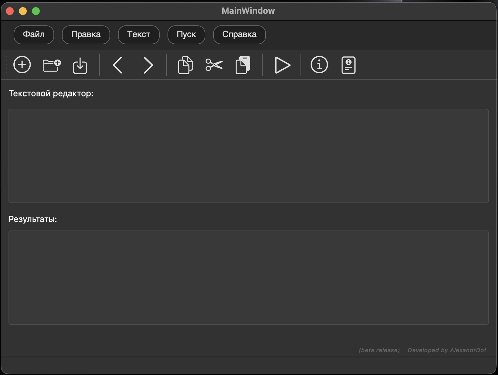
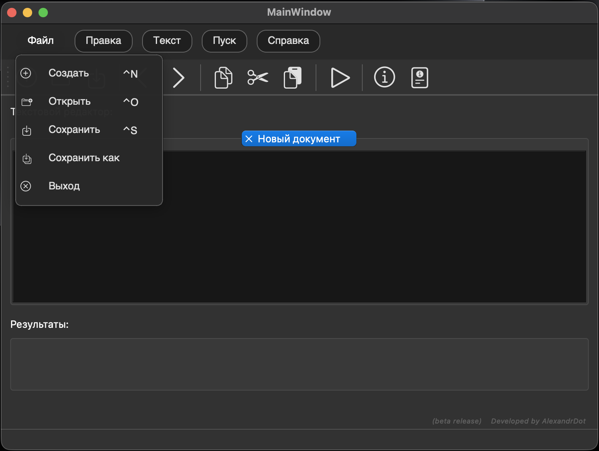
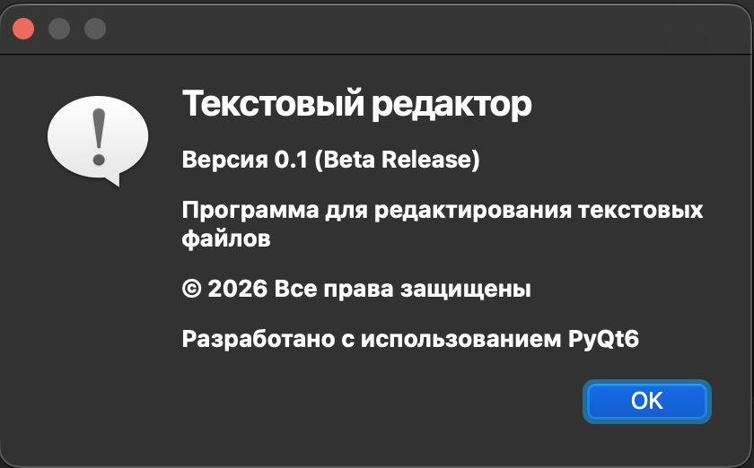

# Editor-Analyzer
A full-fledged language processor for analyzing source code, implemented in Python using the PySide/PyQt 6 framework
<!--Блок информации о репозитории в бейджах-->


## Information about the author
AlexandrDot, 2026

## Project description
A text editor that will later be expanded to a full-fledged language processor for analyzing source code.

## Technologies used
1. Python
2. PyQt6
3. MS Visual Studio

## Download (Mac Os)

[Program Releases]: https://github.com/AlexandrDot/Editor-Analyzer/releases

You must have installed [project dependencies](https://github.com/AlexandrDot/Editor-Analyzer#зависимости)

1. Cloning a repository

```git clone https://github.com/AlexandrDot/Editor-Analyzer.git```

2. Going to the directory Editor-Analyzer

```cd Editor-Analyzer```

3. Creating a virtual environment

```python3 -m venv venv```

4. Activating the virtual environment

```source venv/bin/activate```

5. Installing dependencies

```pip3 install -r requirements.txt```

6. Running a script to demonstrate the capabilities of Editor-Analyzer

```python3 main.py ```

## User's Guide

### A complete user's guide can be obtained at this link: [The manual is in Russian](./docs/ru/manual.md) | [The manual is in English](./docs/en/manual.md)

### File

Item | Hotkey |	What does|
|----------|------------------|-----------|
Create | Ctrl+N |Creates a new document|
Open |Ctrl+O |Opens an existing file|
Save| Ctrl+S |Saves the current file|
Save as...	      |Ctrl+Shift+S|	Saves the file under a new name|
Exit| Ctrl+Q| Closes the program|

### Edit

Item | Hotkey |	What does|
|--|--|--|
Cancel |Ctrl+Z |Cancels the last action
Repeat |Ctrl+Y |Repeats the canceled action
Cut |Ctrl+X |Cuts out the selected text
Copy| Ctrl+C| Copies the selected text
Paste| Ctrl+V|	Inserts text from the clipboard
Delete| Del |Deletes the selected text
Select All| Ctrl+A|	Highlights the entire text

### Help

Point|	What does|
|--|--|
About the program|	Information about the version and author
The Manual|	Opens the help about the program

### Toolbar

Button|	Action|	Description|
|--|--|--|
📄	|Create	| New document
📂	|Open|	Open file
💾	|Save|	Save file
✂️|	Cut|	Cut text
📋|	Copy	|Copy text
📌	|Paste|	Paste text
↩️	|Back	|Cancel action
↪️	|Forward	|Repeat action

### Interface of the program

| Main window | The "File" menu | The "About" menu |
|--------------|-------------|---|
|  |  | 

## Technical limitations

1. Encoding: Only UTF-8 is supported (other encodings may not be displayed correctly)
2. File size: It is not recommended to open files > 100 MB (it may slow down the work)
3. File types: Optimized for text files (.txt, .py, .html, .css, .md)
