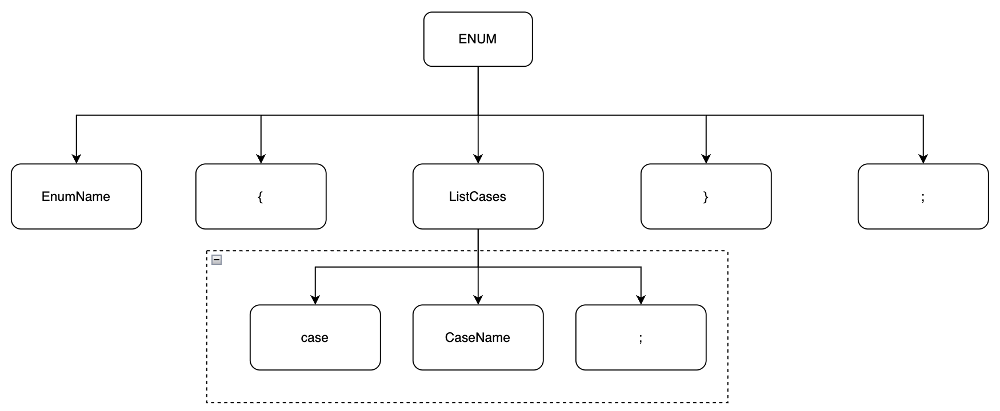
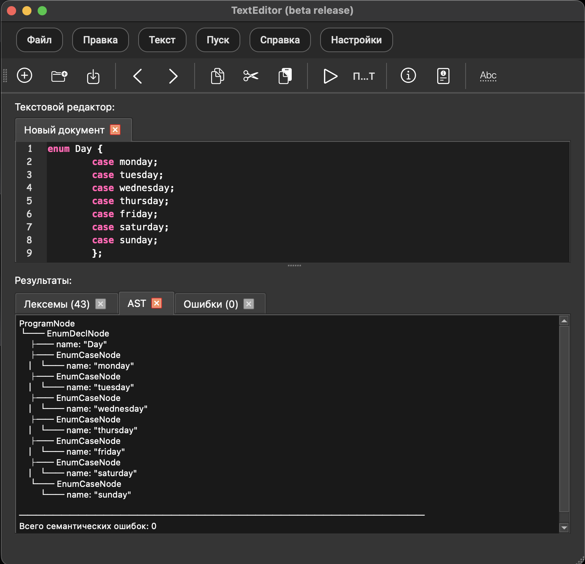

# Abstract Syntax Tree (AST) and Semantic Analysis

This document describes the coursework variant implemented in **Editor-Analyzer**: topic, context-dependent checks, AST node types, output format, test cases (screenshot placeholders), and how to run the project.

---

## 1. Assignment variant: topic and valid input examples

**Topic:** building an **AST** and performing **semantic (context-dependent) analysis** for a small language fragment inspired by **Swift `enum` declarations**.

**Language fragment (informal):** a program is a sequence of enumeration declarations. Each declaration has the form:

```text
enum <Identifier> { case <Identifier> ; ... } ;
```

**Examples of valid programs:**

```text
enum Day {
    case monday;
    case tuesday;
    case wednesday;
};
```

```text
enum Status { case active; case inactive; };
```

```text
enum Direction { case north; case south; case east; case west; };
```

Lexical and syntax rules match the project grammar (see [parser.md](./parser.md)). If **any** lexical or syntax error is present, the **AST is not built** and semantic checks for the tree are skipped; the **AST** tab explains this, and the graphical **Show AST** window stays disabled until the text is clean.

---

## 2. Context-dependent conditions: implemented checks vs. general lab template

The general laboratory formulation often lists four groups of rules. In **this** project the source language contains **only `enum` declarations** (no constants with types, no functions, no expressions). Therefore:

| Rule (typical lab wording) | Status in Editor-Analyzer | Notes / examples |
|----------------------------|---------------------------|------------------|
| **Identifier uniqueness** (no second declaration of the same name in the same scope) | **Implemented** | **Enum names** must be unique across the whole program. **Case names** must be unique **within** the same `enum`. |
| **Type compatibility** (initializer vs. declared type) | **Not applicable** | No typed `const`/`var` or initializers in the current grammar. Reserved for a future language extension. |
| **Allowed numeric (or other) values** | **Not applicable** | No numeric literals in declarations. Reserved for a future extension. |
| **Use of declared identifiers** (expressions only use declared names) | **Not applicable** | No expression grammar; identifiers appear only in `enum` / `case` positions. Reserved for a future extension. |

### 2.1 Implemented checks: examples and expected messages

Messages below match the **Russian** UI by default; with **English** UI, the same logic uses the English phrasing shown in parentheses.

#### A) Duplicate enum name (same program scope)

**Input example:**

```text
enum A { case x; };
enum A { case y; };
```

**Expected:** second `A` is rejected semantically; **AST contains only the first** `enum A` (and its cases).  
**Error row (RU):** fragment `A`, description similar to: `Семантическая ошибка: идентификатор 'A' уже объявлен ранее`.  
**Error row (EN):** `Semantic error: identifier 'A' has already been declared`.

#### B) Duplicate `case` name inside the same `enum`

**Input example:**

```text
enum A { case B; case B; };
```

**Expected:** first `B` stays in the AST; the second `B` produces a semantic error and **is not** added as a second case node.  
**Error row (RU):** fragment `B`, description similar to: `Семантическая ошибка: вариант 'B' в перечислении 'A' уже объявлен`.  
**Error row (EN):** `Semantic error: case 'B' in enum 'A' is already declared`.

#### C) Lexical or syntax errors

**Expected:** **no AST** (empty message on the AST tab), **no** semantic error list from the partial tree; fix lexer/parser issues first, then run **Run / Пуск** again.

---

## 3. AST structure: node types

The generic coursework list (`ConstDeclNode`, `FunctionDeclNode`, `IfNode`, `WhileNode`, …) describes a **richer** language. **This repository** implements nodes that match the **enum-only** grammar:

| Node type | Role | Typical attributes | Children |
|-----------|------|--------------------|----------|
| **`ProgramNode`** | Root of the whole input | (none required) | Zero or more `EnumDeclNode` |
| **`EnumDeclNode`** | One `enum` declaration | `name` — enum identifier | Zero or more `EnumCaseNode` (after filtering duplicates) |
| **`EnumCaseNode`** | One `case` branch | `name` — case identifier | (none) |

Implementation: `ast_nodes.py` (`AstNode` with `node_type`, `attrs`, `children`).  
Construction and semantic checks: `parser.py` (during successful parse of each full `enum … { … } ;`).

**Relation to the coursework list:** `ConstDeclNode`, `FunctionDeclNode`, `IfNode`, `WhileNode`, `BinaryOpNode`, `VariableNode`, `LiteralNode` are **not** used until the language is extended; the table above is the authoritative set for the current version.

---

## 4. CST / AST figure (external editor, e.g. draw.io)

Draw a **concrete syntax tree (CST)** or **AST** for one valid line or small program (for example `enum A { case B; };`) in any graphical editor (draw.io, Excalidraw, etc.), export as **PNG**, and place it in the repository.

**Suggested file name and link (add your image next to the path):**

<div align="center">



*Figure 1. CST or AST for a valid program fragment (replace with your export).*

</div>

If the image is not committed yet, the link above still documents where to put the file: `screenshots/ast_cst_drawio.png`.

---

## 5. AST output format inside the program

### 5.1 Text tab (**AST**)

After **Run / Пуск**, the lower panel adds an **AST** tab when analysis runs. If the program is **lexically and syntactically** valid, the tab shows:

1. A **tree** using indentation and **box-drawing** characters (`├──`, `└──`) and attribute lines (`name: "…"`).
2. A short **separator** line.
3. A **single summary line**: total count of **semantic** errors (Russian: `Всего семантических ошибок: N`; English: `Total semantic errors: N`).

The editor uses a **monospace** font in this tab so the tree aligns correctly.

**Example (logical shape, not a screenshot):**

```text
ProgramNode
└── EnumDeclNode
    ├── name: "A"
    └── EnumCaseNode
        └── name: "B"

────────────────────────────────────────────────
Всего семантических ошибок: 0
```

### 5.2 Graphical window (**Show AST** / **Показать AST`)

**Menu:** Play → Show AST; **toolbar**; shortcut **Ctrl+Shift+A** (when defined in `design.ui`).

- **PyQt6** `QGraphicsScene` / `QGraphicsView`: each node is a rectangle with **node type** and **attributes**; **lines** connect parent and child.
- The window opens only if the **last successful analysis** produced a buildable AST (no lexical/syntax errors).

---

## 6. Test examples (screenshots)

Add your own screenshots under `screenshots/` and keep the names below (or adjust the paths in this file).

| # | What to capture | Suggested path |
|---|-----------------|----------------|
| 1 | Valid program: **AST** tab with tree + zero semantic errors | [`../../screenshots/ast_test_valid_tab.png`](../../screenshots/ast_test_valid_tab.png) |
| 2 | Same or other valid program: **graphical Show AST** window | [`../../screenshots/ast_test_graphic_window.png`](../../screenshots/ast_test_graphic_window.png) |
| 3 | Duplicate **enum** name: **Errors** tab + **AST** tab (only first enum) | [`../../screenshots/ast_test_duplicate_enum.png`](../../screenshots/ast_test_duplicate_enum.png) |
| 4 | Duplicate **case**: **Errors** tab + **AST** tab (single case node) | [`../../screenshots/ast_test_duplicate_case.png`](../../screenshots/ast_test_duplicate_case.png) |
| 5 | Lexical or syntax error: **AST** tab shows “tree not built” message | [`../../screenshots/ast_test_blocked_by_syntax.png`](../../screenshots/ast_test_blocked_by_syntax.png) |

Example embed for the first row (after you add the file):

```markdown

```

---

## 7. How to build and run (brief)

There is **no compile step** for the Python sources; install dependencies and run the GUI entry point.

1. **Clone** the repository and **cd** into the project root (`Editor-Analyzer`).
2. **Optional:** create and activate a virtual environment (`python3 -m venv venv`, `source venv/bin/activate` on macOS/Linux).
3. **Install dependencies:**  
   `pip install -r requirements.txt`  
   (requires **PyQt6** and project-listed packages.)
4. **Run the application:**  
   `python3 main.py`

For packaged releases (if any), follow the instructions in the main [README.md](../../README.md).

---

## 8. File map (implementation)

| File | Purpose |
|------|---------|
| `ast_nodes.py` | `AstNode`, `format_ast_tree()` |
| `parser.py` | Syntax analysis, AST construction, semantic error list |
| `ast_view.py` | Graphical AST dialog |
| `TextEditor.py` | Result tabs (tokens, AST text, errors), `Show AST` action |

---

*Last updated: aligns with Editor-Analyzer enum-only grammar and AST/semantic behavior described above.*
