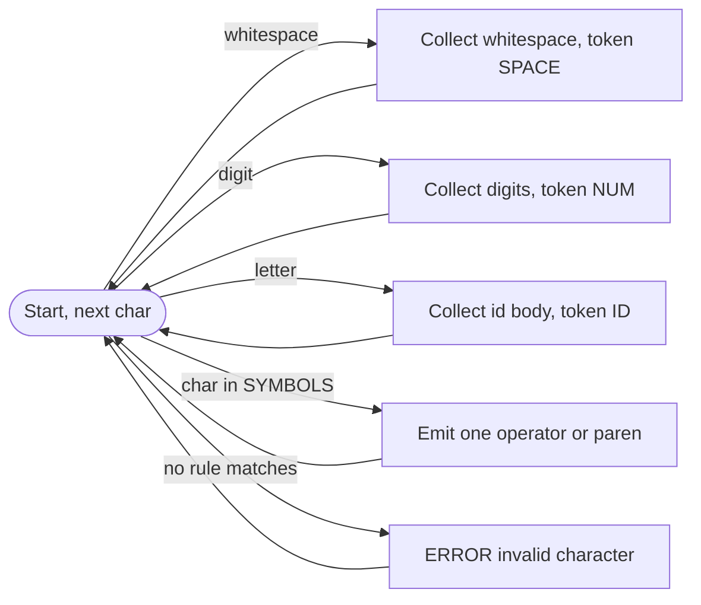
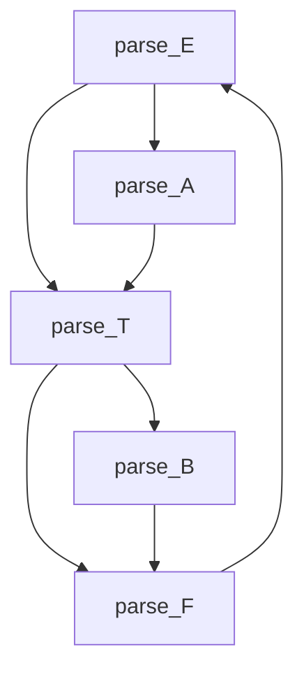

# Laboratory work 6: Internal program representation (tetrads and POLIZ)

This document matches the **Editor-Analyzer** variant implemented in the repository: a small **expression language** (arithmetic), lexer, recursive-descent parser, **tetrads** `(op, arg1, arg2, result)`, and **POLIZ (RPN)** with integer evaluation via Dijkstra’s shunting-yard algorithm.

**Screenshot files:** add your exported PNG (or other) files under `screenshots/lab6/` using the paths below.

---

## 1. Assignment variant: language fragment and context-free grammar

### 1.1 Informal language

The analyzed “language” is a **single arithmetic expression** over:

- non-negative **integer literals** (`num`);
- **identifiers** (`id`, for symbolic operands in tetrads only);
- binary operators **`+`, `-`, `*`, `/`, `%`**;
- parentheses **`(` `)`**;
- **whitespace** (ignored by the parser).

One input string in the editor is treated as **one expression** (line breaks act like whitespace between tokens).

### 1.2 Lexical rules (regular / token classes)

| Token class | Pattern (informal) | Examples |
|-------------|-------------------|----------|
| `num` | one or more decimal digits | `0`, `42`, `100` |
| `id` | letter, then letters / digits / `_` | `x`, `a1`, `var_name` |
| operators | single character | `+`, `-`, `*`, `/`, `%` |
| delimiters | single character | `(`, `)` |
| whitespace | spaces, tab | (skipped by the parser) |

**Lexical error:** any character that cannot start a valid token in the current state (e.g. `@`, `.` in `3.14`).

### 1.3 Context-free grammar (recursive-descent friendly)

Nonterminals: `E` (expression), `T` (term), `F` (factor), `A` / `B` (tails for `+`/`-` and `*`/`/`/`%`).

```text
E → T A
A → ε | + T A | - T A
T → F B
B → ε | * F B | / F B | % F B
F → num | id | ( E )
```

**Operator precedence:** `*`, `/`, `%` bind tighter than `+` and `-` (encoded by splitting `E`/`T` and tails `A`/`B`). Operators of the same precedence associate **left-to-right**.

### 1.4 Examples of **valid** strings

```text
42
x
(a + b) * c
10 / 2 + 3
(1 + 2) * (3 + 4)
a + b * c - d / e % 5
```

---

## 2. Lexical analysis: state-transition diagram

The lexer scans a line left-to-right. Below is a **logical** finite-state view (implementations may merge states in code).



(`SYMBOLS` in code maps `+`, `-`, `*`, `/`, `%`, `(`, `)` to token codes.)

**Your screenshot (diagram drawn in draw.io, Dia, etc.):**


---

## 3. Syntax analysis: recursive-descent scheme

Procedures correspond 1:1 to nonterminals (see `parser.py`):

| Procedure | Grammar rule | Role |
|-----------|--------------|------|
| `parse_E` | `E → T A` | Entry point for expression |
| `parse_A` | `A → ε \| + T A \| - T A` | Lower-precedence `+` / `-` chain |
| `parse_T` | `T → F B` | Start of term |
| `parse_B` | `B → ε \| * F B \| / F B \| % F B` | Higher-precedence `*` / `/` / `%` chain |
| `parse_F` | `F → num \| id \| ( E )` | Primary |

**Control flow (calls):**



Arrows mean: `parse_E` calls `parse_T` then `parse_A`; `parse_T` calls `parse_F` then `parse_B`; `parse_F` on a left parenthesis calls `parse_E` again; `parse_A` loops on `+` or `-` and each time calls `parse_T`; `parse_B` loops on `*`, `/`, or `%` and each time calls `parse_F`.

### 3.1 Syntax errors reported (illustrative)

| Situation | Typical message (RU / EN in app) |
|-----------|----------------------------------|
| Illegal character | Lexical error |
| Missing operand (e.g. `1++2`, empty `()`) | Syntax: missing operand |
| Extra `)` after a complete expression | Syntax: extra closing parenthesis |
| `(` without matching `)` | Syntax: expected `)` |

**Your screenshots:** lexer token table + errors tab for **2–3 test strings** (one valid, one lexical error, one syntax error).


---

## 4. Internal representation: tetrads

For **syntactically correct** input only, the parser builds **tetrads** (quadruples):

```text
(op, arg1, arg2, result)
```

Intermediate results use temporaries **`t1`, `t2`, `t3`, …**

**Example** for `3 + 4 * 5`:

| # | op | arg1 | arg2 | result |
|---|----|------|------|--------|
| 1 | `*` | `4` | `5` | `t1` |
| 2 | `+` | `3` | `t1` | `t2` |

**Your screenshot:** main window, tab **“Тетрады / ПОЛИЗ”** (or **“Tetrads / RPN”**) for a **correct** chain, showing the tetrad list.


---

## 5. POLIZ (reverse Polish notation)

- **Construction:** shunting-yard algorithm on the token stream (same precedence as the grammar).
- **Restriction in this lab:** **POLIZ string and numeric value** are shown **only if the expression contains integer literals only** (no identifiers). If identifiers appear (e.g. `a + b`), tetrads may still be listed, with an explanatory note instead of POLIZ/value.

**Example** (integers only), expression `3 + 4 * 5`:

- **POLIZ:** `3 4 5 * +`
- **Value:** `23`

**Your screenshot:** the same (or another) run with **only integers**, showing **POLIZ line + computed value**.


---

## 6. How to run

From the project root (after installing dependencies):

```bash
python3 main.py
```

Enter an expression in the editor, then **Play → Run** (Пуск). Inspect tabs **Tokens**, **Tetrads / RPN**, and **Errors**.

---

## 7. File checklist (screenshots you attach)

| # | Relative path (from repo root) | Content |
|---|-------------------------------|---------|
| 1 | `screenshots/lab6/lexer-state-diagram.png` | Lexer diagram |
| 2 | `screenshots/lab6/run-tokens-valid.png` | Tokens for a valid expression |
| 3 | `screenshots/lab6/run-errors-lexical.png` | Lexical error example |
| 4 | `screenshots/lab6/run-errors-syntax.png` | Syntax error example |
| 5 | `screenshots/lab6/tetrads-tab.png` | Tetrads for a correct chain |
| 6 | `screenshots/lab6/poliz-and-value.png` | POLIZ + value (integers only) |

Create the folder:

```text
screenshots/lab6/
```

if it does not exist, then drop your images there with the names above (or change the paths in this file to match your filenames).
