# User's Guide

*Depending on the platform, the interface may vary slightly.*

 

## Launching the program
- After launching the program, the user sees the main window where he can select an action from the menu or quick access.
- Initially, the editor window is unavailable due to the absence of a file in it, you need to create one.

 

  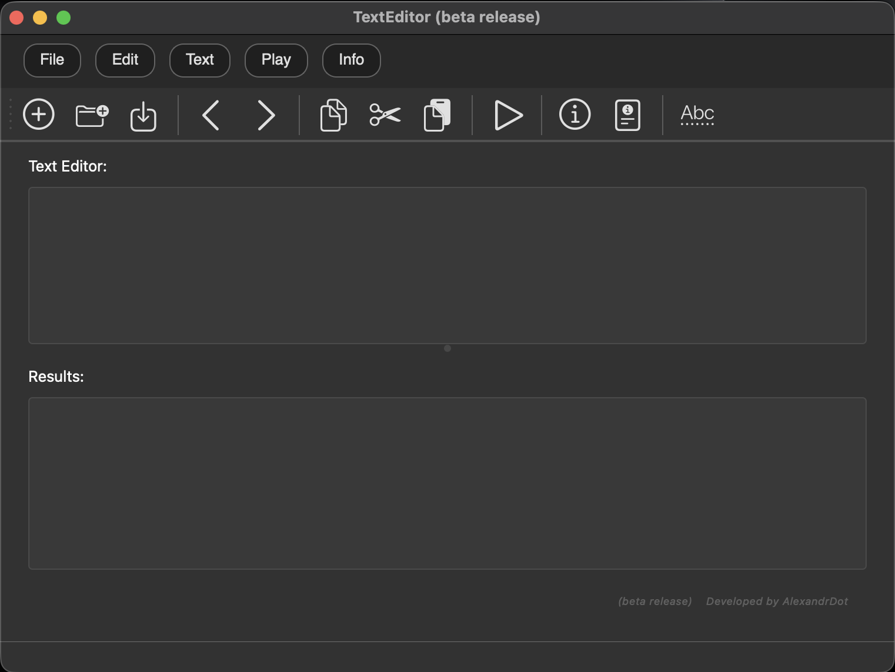

 

 

## Working with the "File" item
1. When you click "create", a new text document will appear in the editor, in which you can enter text.

  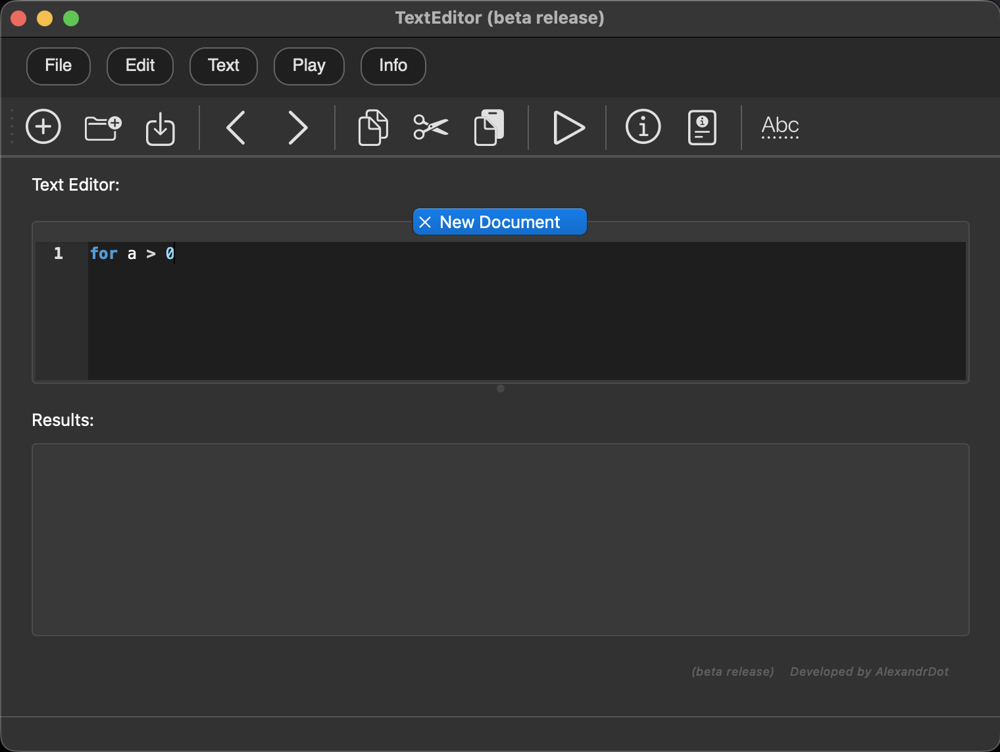

 

 
2. When you click "open", an explorer appears, with which you can find the required document and after selecting it, it will be displayed in the editor.
 
 

  <table>
    <tr>
      <td>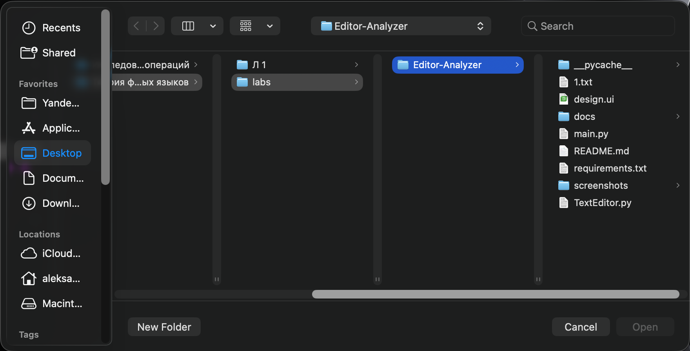</td>
      <td>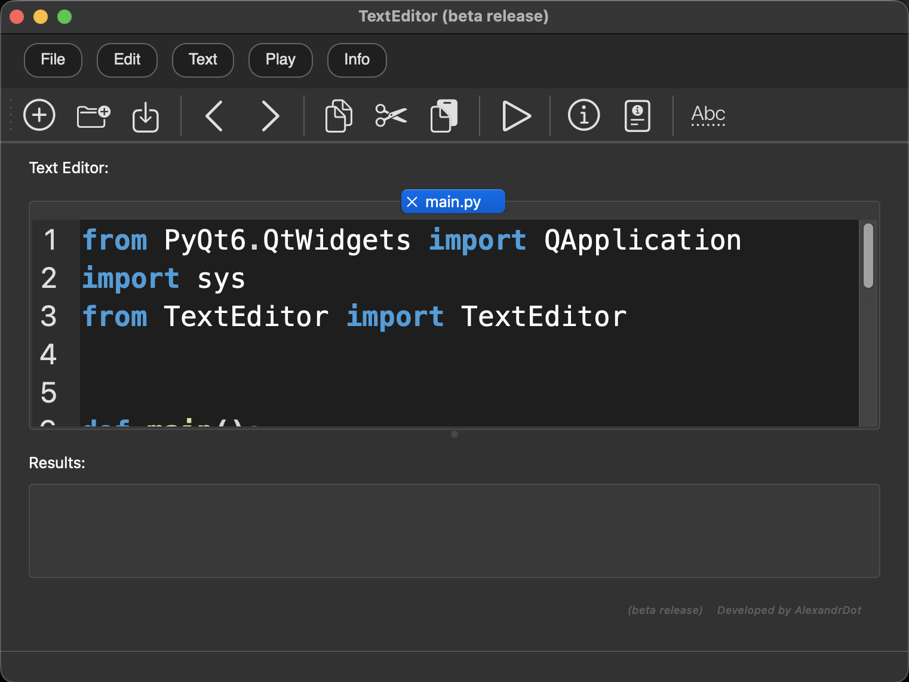</td>
    </tr>
    <tr>
      <td align="center"><em>Map</em></td>
      <td align="center"><em>Opened file</em></td>
    </tr>
  </table>

 

3. When you click "save" for a new document, a dialog box will appear showing where and in which option to save the file, and for an existing document, the changes will be saved.

4. When you click "save as", a similar window will appear, as in paragraph 3)

  <table>
    <tr>
      <td>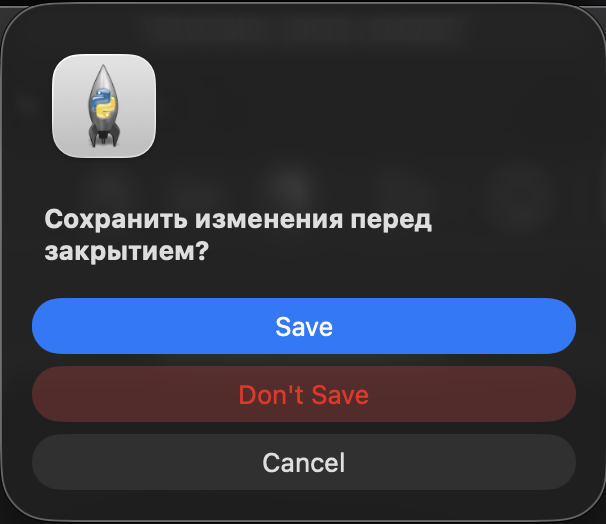</td>
      <td>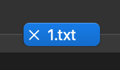</td>
    </tr>
    <tr>
      <td align="center"><em>Where to save</em></td>
      <td align="center"><em>Saved</em></td>
    </tr>
  </table>

 
5. When you click Exit, a notification will be displayed if there are unsaved files. You can either save or delete them, and then exit the program.
 

  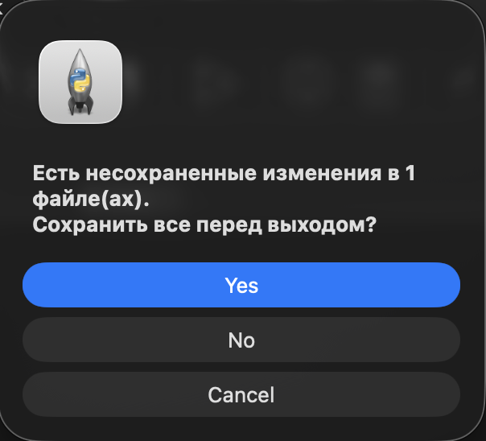

 

 
 

## Working with the "Edit" item

 

1. Clicking **"undo"** in the active editor file will rollback to the last change.

  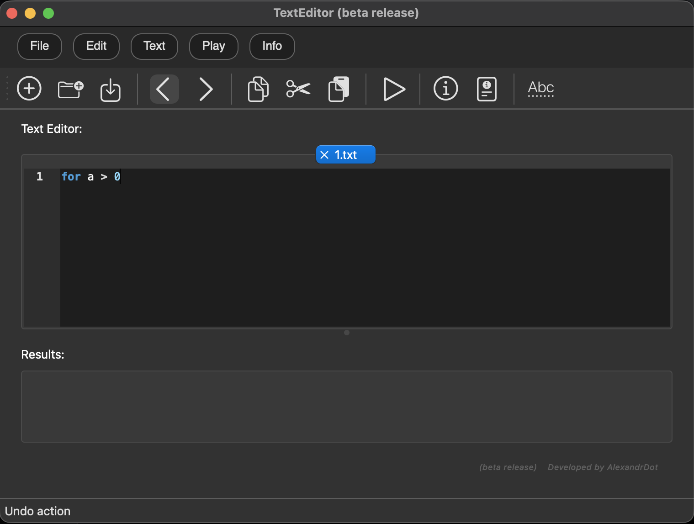

 
 

2. When you click **"repeat"** in the active editor file, you will return to the last change.

  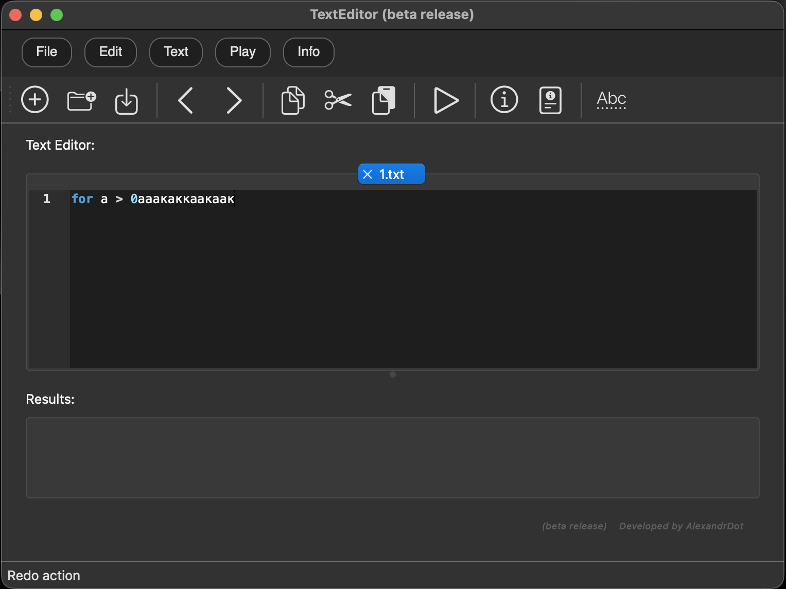

 
 

3. When you click **"cut"** in the active editor file, the selected text will be cut out.

  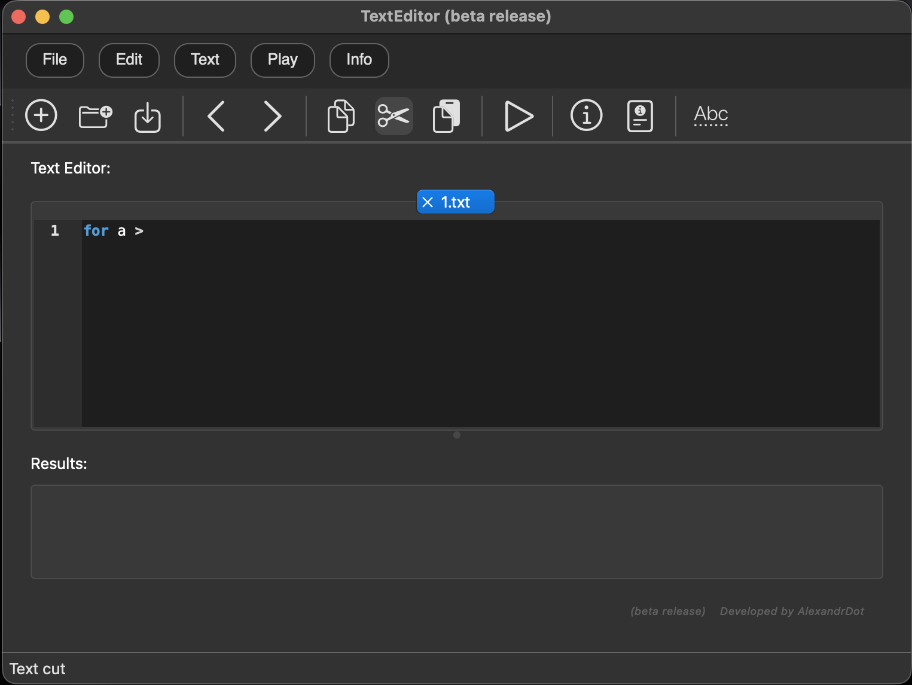

 
 

4. When you click **"copy"** in the active editor file, the selected text will be copied

  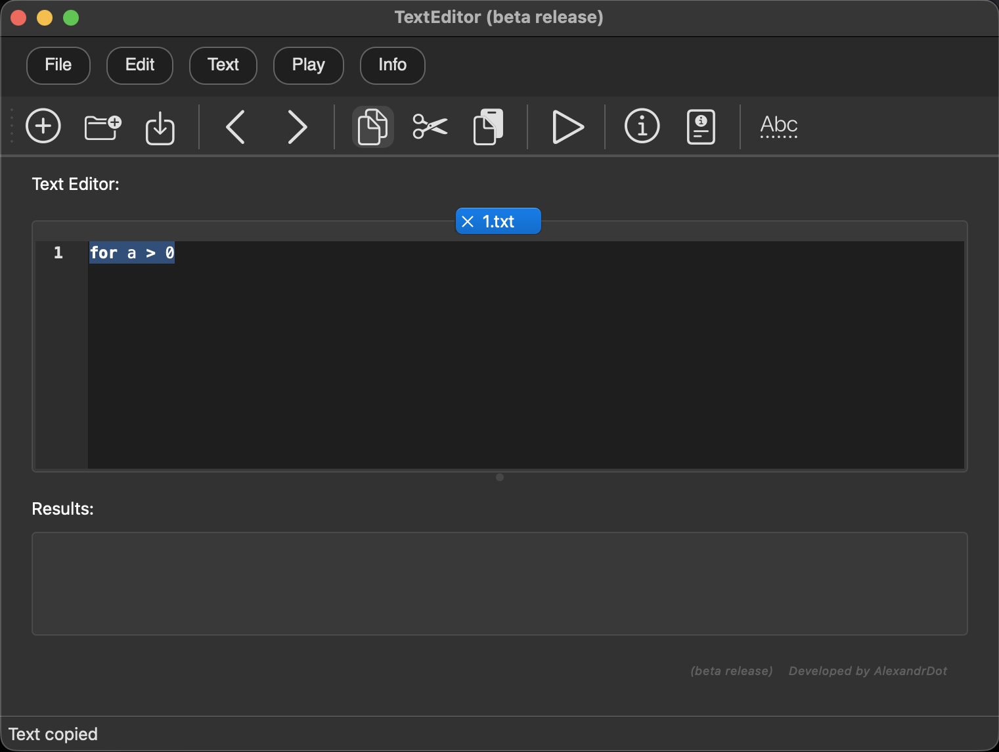

 
 

5. When you click **"paste"** in the active file editor, text will be inserted from the clipboard.

  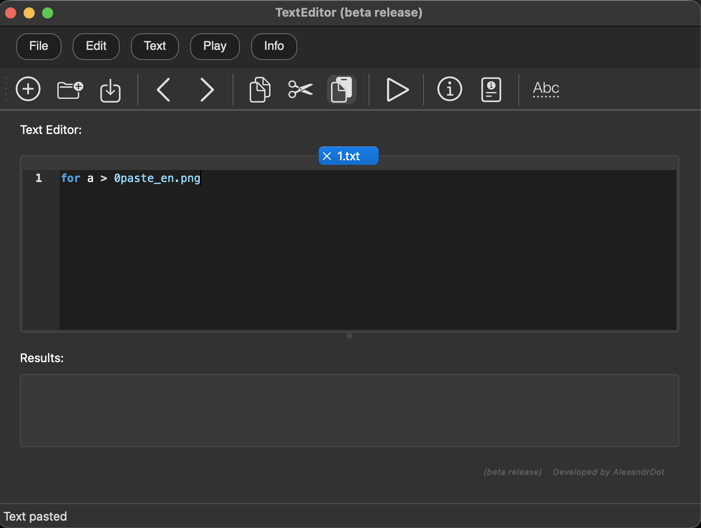

 
 

6. When you click **"delete"** in the active editor file, the selected text will be deleted.

  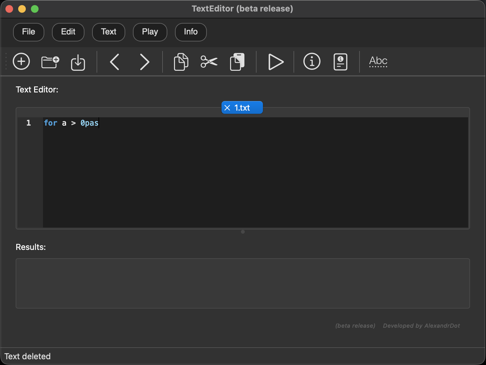

 
 

7. When you click **"select all"** in the active editor file, the entire text will be highlighted

  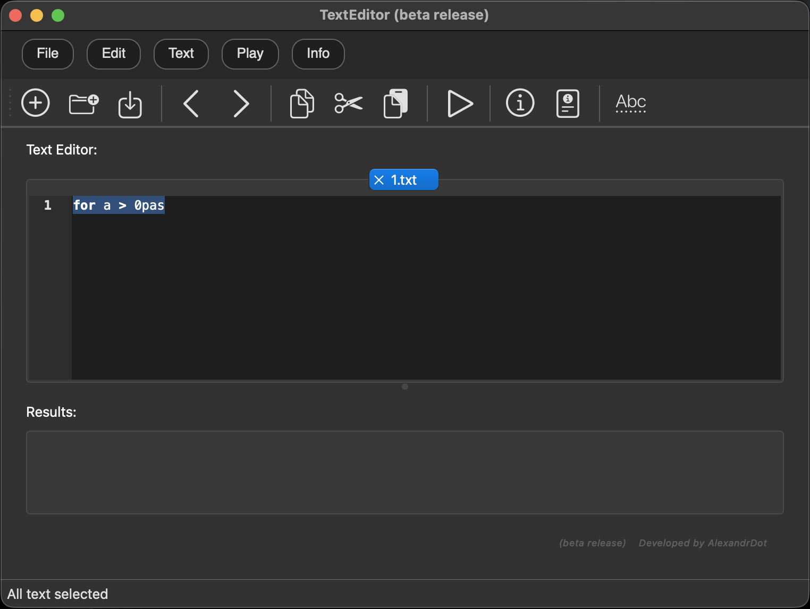

## Working with the "Text" item

### ***In development***

 
 

## Working with the "Start" item

### ***In development***

 
 

## Working with the "Help" item

 

The Help menu contains information sections that help the user to familiarize themselves with the program and obtain the necessary documentation.

  

 
 

### 1. About

When you select **"about the program"**, a dialog box opens containing information about the application version, release year, author, and technologies used. This window allows you to verify that the version is up to date and get general information about the program.

  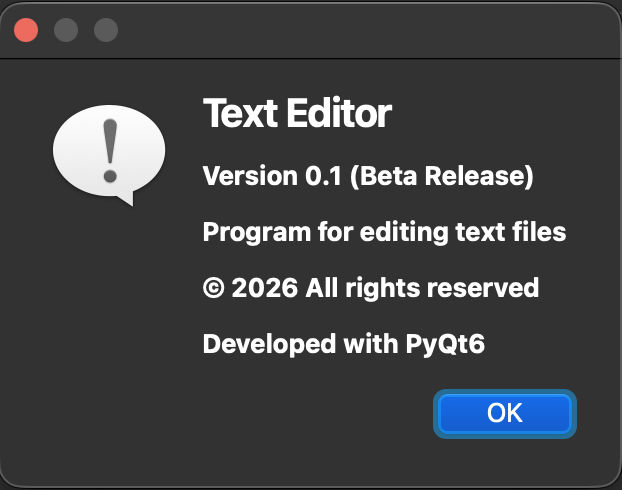

 
 

### 2. User's Guide

When you select **"manual"**, a window opens with a brief guide on how to use the program. The main functions and keyboard shortcuts are presented here. At the bottom of the window there is a link to the full documentation, where you can find more detailed information.

  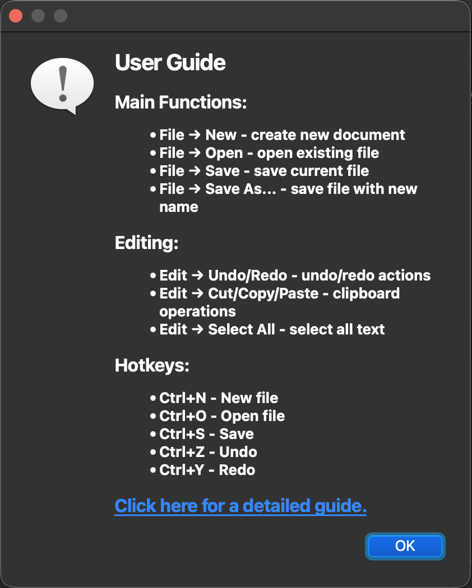

 
 

### Additional information

- All dialog boxes are closed by pressing the **OK button**
- Text in windows can be highlighted and copied for use in other applications
- Full documentation is available at the link in the manual window