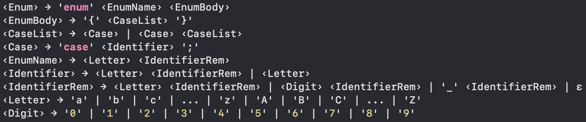
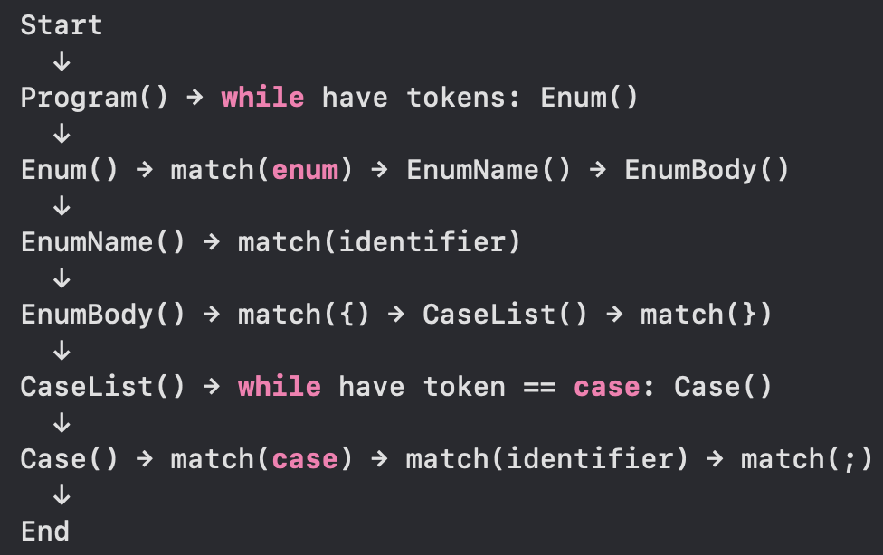
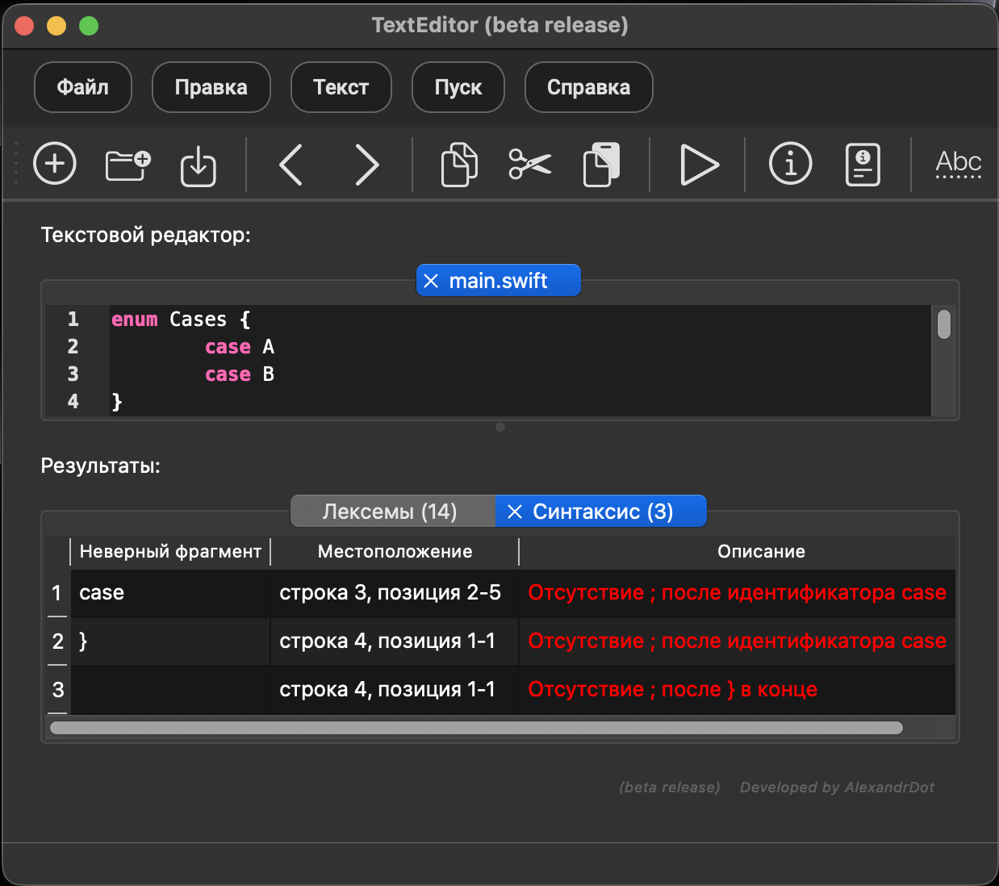
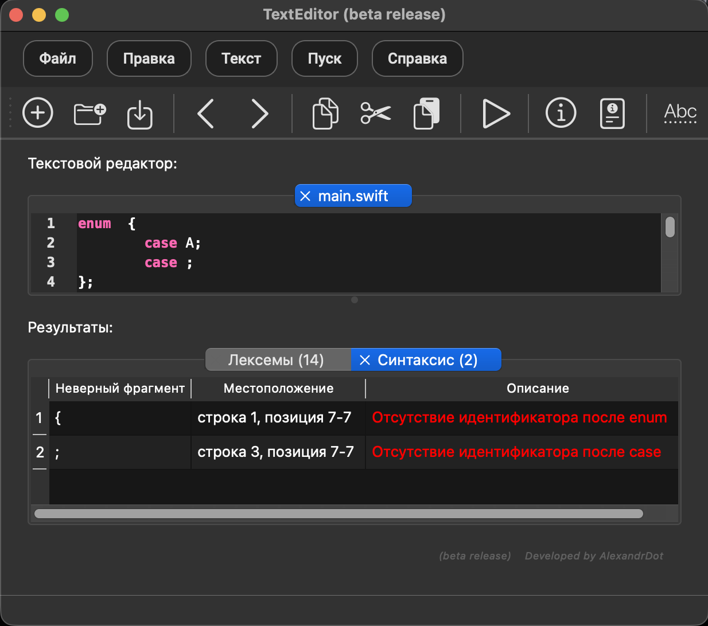
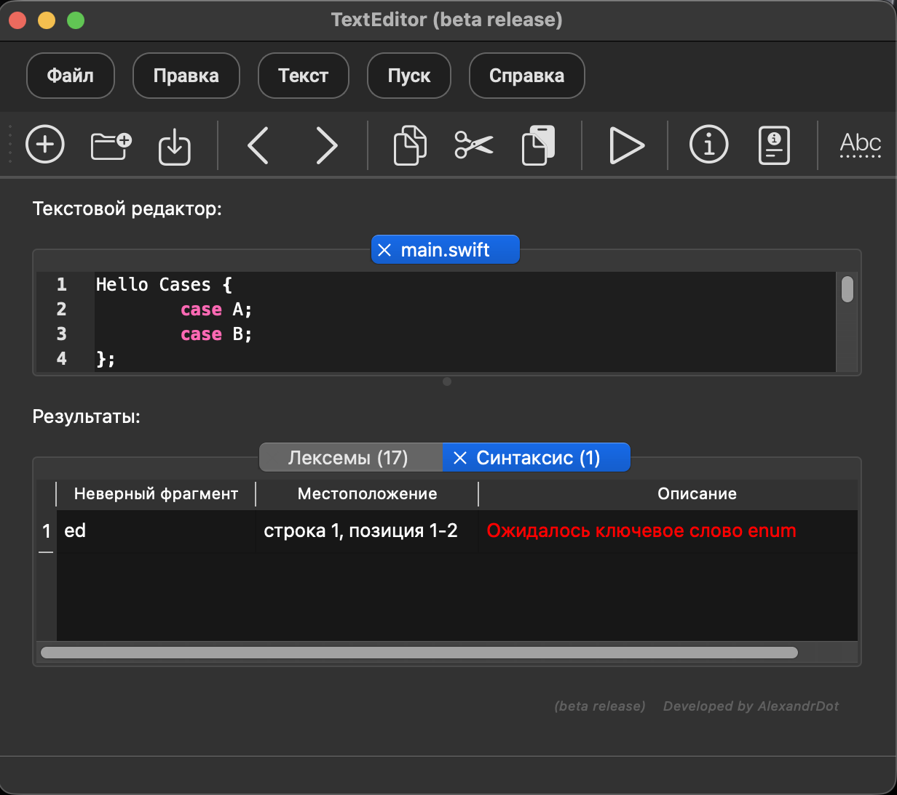

## Development of a Syntax Analyzer (Parser) for the Swift enum Construct

## 1. Grammar Development (Full Definition of the Developed Grammar)

The grammar G[Enum] in BNF notation is defined as follows:

  
   
  <em>Figure 1. Schematic representation of the grammar</em>

### Explanation of Grammar

| Symbol Type | Symbol | Description |
|-------------|--------|-------------|
| **Terminal** | `enum` | Keyword indicating the start of an enumeration |
| | `case` | Keyword indicating a case element |
| | `{` | Opening curly brace |
| | `}` | Closing curly brace |
| | `;` | Semicolon (statement terminator) |
| | `_` | Underscore character (allowed in identifiers) |
| | `a`-`z`, `A`-`Z` | Letters of the Latin alphabet |
| | `0`-`9` | Digits |
| **Non-terminal** | `<Enum>` | Enumeration declaration |
| | `<EnumBody>` | Body of the enumeration |
| | `<CaseList>` | List of case blocks |
| | `<Case>` | Single case block |
| | `<EnumName>` | Name of the enumeration |
| | `<Identifier>` | Identifier |
| | `<IdentifierRem>` | Remainder of the identifier |
| | `<Letter>` | Letter |
| | `<Digit>` | Digit |

---

## 2. Classification of Grammar (According to Chomsky)

This grammar belongs to **context-free (CF) grammars of type 2**.

### Justification:

| Criterion | Verification |
|-----------|--------------|
| Rules have the form `A → α` | ✅ All rules have one nonterminal on the left side |
| `α` is an arbitrary chain of terminals and non-terminals | ✅ Example: `<Case> → case <Identifier> ;` |
| No rules of the form `αAβ → αγβ` | ✅ There are no contextual conditions |
| Not regular | ✅ Rules contain two terminals in a row (`case`, `<Identifier>`, `;`) |

## 3. The Method of Analysis (Recursive Descent)

The **recursive descent method** is chosen for the analysis, which refers to the top-down methods of syntactic analysis.

### Analysis Scheme:

  
   
  <em>Figure 2. Recursive descent</em>

### Algorithm of Operation:

1. Start with the non-terminal `<Enum>`
2. Check for the `enum` keyword
3. Read the enumeration name (identifier)
4. Check for the opening brace `{`
5. Analyze all case blocks in a loop
6. Check for the closing brace `}`
7. Check for the ending semicolon `;`

---

## 4. Diagnosis and Neutralization of Syntax Errors

### 4.1 Error Diagnosis

When a syntax error is detected, the parser records:

| Field | Description |
|-------|-------------|
| `fragment` | Invalid fragment (the character that caused the error) |
| `line` | Line number |
| `start_pos` | Starting position of the symbol |
| `end_pos` | Ending position of the symbol |
| `message` | Text description of the error |

### Types of Diagnosed Errors:

| Situation | Error Message |
|-----------|---------------|
| The first token is not `enum` | Expected keyword `enum` |
| No identifier after `enum` | Missing identifier after `enum` |
| No `{` after identifier | Missing `{` after enum identifier |
| No `case` inside `{}` | Expected keyword `case` |
| No identifier after `case` | Missing identifier after `case` |
| No `;` after identifier | Missing `;` after case identifier |
| No closing `}` | Missing `}` at the end |
| No `;` after `}` | Missing `;` after `}` at the end |

### 4.2 Error Neutralization (Irons Method)

The Irons method is used to continue the analysis after an error is detected. In case of an error, the parser skips tokens until it encounters a token from the FOLLOW set of the current nonterminal.

## 5. Test examples

### 5.1 Forgot ";"

  
   
  <em>Figure 3. Forgot ";"</em>

### 5.2 There is no ID

  
   
  <em>Figure 4. No ID</em>

### 5.3 Expected keyword

  
   
  <em>Figure 5. Expected keyword</em>

