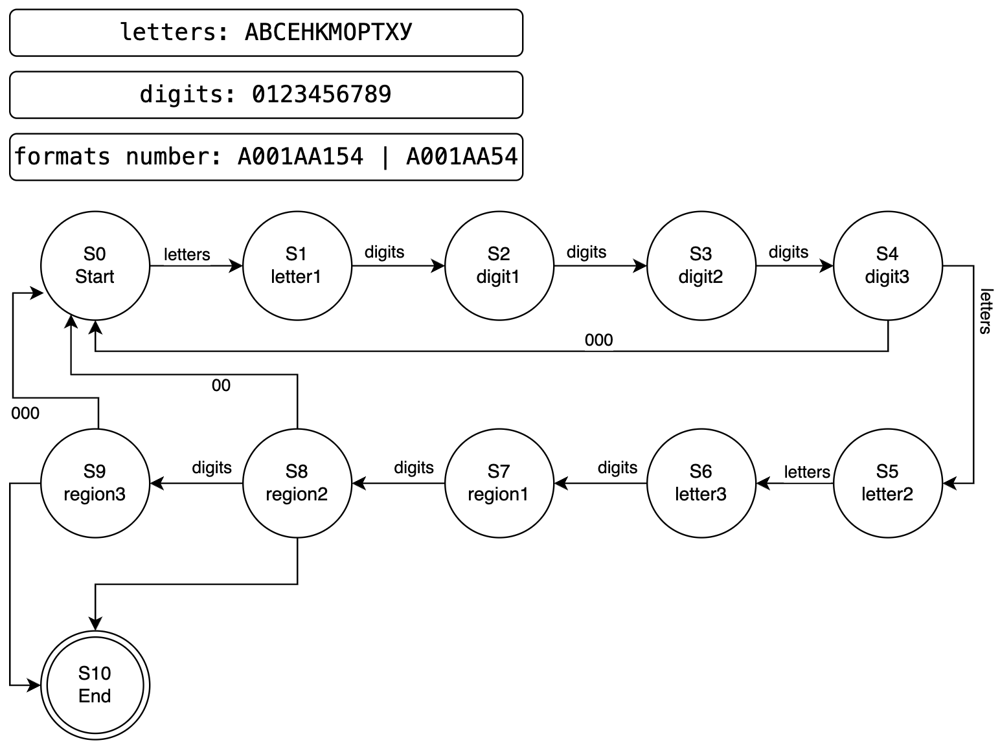

## The first task is to construct an expression describing Chinese postal codes.
    pattern = r'(?<!\d)\d{6}(?!\d)'

### Examples of strings to be found:
1. Hello123456-_- Found: 123456
2. ICANT000001GG345678GGVP Found: 000001, 345678

### Examples of strings that will not be found:
1. Hello12345678ImOK
2. 12345AABB

### Testing
| Hello123456-_- | ICANT000001GG345678GGVP | Hello12345678ImOK | 12345AABB|
|--------------|-------------|---| -- |
|  |  |  | |

## The second task is to construct an expression describing the password (a set of lowercase and uppercase Latin and Russian letters, numbers and symbols, at least 10 characters long).
    pattern = r'^(?=.*[a-zA-Z])(?=.*[а-яА-Я])(?=.*\d)(?=.*[!@#$%^&*()_+\-=\[\]{};:\'",.<>/?\\|`~]).{10,}$'
        
       - (?=.*[a-z]) - at least one lowercase Latin letter
       - (?=.*[A-Z]) - at least one uppercase Latin letter
       - (?=.*[a-z]) - at least one lowercase Cyrillic alphabet
       - (?=.*[A-Z]) - at least one uppercase Cyrillic alphabet
       - (?=.*\d) - at least one digit
       - (?=.*[!@#$%^&*()_+\-=\[\]{};:\'",.<>/?\\|`~]) - at least one special character
       - .{10,} - minimum of 10 characters
    
### Examples of strings that will be found:
1. Fпривет12.  Found: Fпривет12.
2. ZVW51_$$$О444УС54$$$ Found: ZVW51_$$$О444УС54$$$

### Examples of strings that won't be found:
1. ABC
2. asdfghjk12frgr

### Testing
| Fпривет12. | ZVW51_$$$О444УС54$$$ | ABC | asdfghjk12frgr|
|--------------|-------------|---|-- |
|  |  |  | |

## The third task is to construct an expression describing the Russian license plates of civilian cars.
    pattern = rf'{letters}(?!0{{3}})\d{{3}}{letters}{{2}}(?!0{{2,3}})\d{{2,3}}' 
    letters = r'[АВСЕНКМОРТХУ]'

        - Format: LETTER + 3 digits + 2 letters + 2-3 digits of the region
        - (?!0{3}) - The number can't be 000
        - (?!0{2,3}) - the region cannot be 00 or 000

### Examples of strings that will be found:
1. О444УС54 Found: О444УС54
2. АБВР338РХ154АБВ Found: Р338РХ154

### Examples of strings that won't be found:
1. А000АА154
2. А414Л777
3. О444УУ000

### Testing
| О444УС54 | АБВР338РХ154АБВ | А000АА154 | А414Л777| О444УУ000 |
|--------------|-------------|---|-- |-- |
|  |  |  | | |

## Additional task: For problem 3, it is necessary to implement an algorithm for searching substrings in the text by going to the graph of the automaton.

### State diagram of a finite state machine

  
   
  <em>Figure 1. State diagram of a finite state machine</em>

### Examples of strings that will be found:
1. О444УС54 Found: О444УС54
2. АБВР338РХ154АБВ Found: Р338РХ154

### Examples of strings that won't be found:
1. А000АА154
2. А414Л777
3. О444УУ000
