# Лабораторная работа 7: AST/IR для `enum` и локальные оптимизации

## Цель работы

- Изучить, как конструкция **перечисления (`enum`)** представляется в **AST** Clang.
- Сравнить **LLVM IR** без оптимизаций и с оптимизациями (`-O0` vs `-O2`) и понять, когда перечисления заменяются на константы.
- Построить **CFG** для функции `main`.
- (Доп.) Представить фрагмент в виде упрощённого **трёхадресного кода (TAC)** и применить локальные оптимизации.

---

## Исходный код (C)

```c
enum Color { RED, GREEN, BLUE };
int main() {
    enum Color c = GREEN;
    int val = c + 10;
    return val;
}
```

Файл: `main.c`.

---

## 1) Подготовка окружения (macOS)

Clang предустановлен в составе Xcode, дополнительно устанавливается `llvm`:

```bash
brew install llvm
```

Если нужно использовать Homebrew LLVM первым в `PATH`:

```bash
echo 'export PATH="/usr/local/opt/llvm/bin:$PATH"' >> ~/.zshrc
export LDFLAGS="-L/usr/local/opt/llvm/lib"
export CPPFLAGS="-I/usr/local/opt/llvm/include"
```


## 2) Получение AST (Clang)

Команда:

```bash
/usr/local/opt/llvm/bin/clang -Xclang -ast-dump -fsyntax-only main.c
```

### Как представлено перечисление в AST

- Перечисление — узел **`EnumDecl`**, содержащий:
  - имя перечисления (`Color`);
  - список элементов `EnumConstantDecl`: `RED`, `GREEN`, `BLUE`.
- Константам автоматически назначаются целые значения, начиная с `0`.
- Использование `GREEN` в коде — это `DeclRefExpr` (ссылка на объявление) + неявное преобразование `ImplicitCastExpr` из `enum Color` в `int`.

**Скриншот AST dump:**

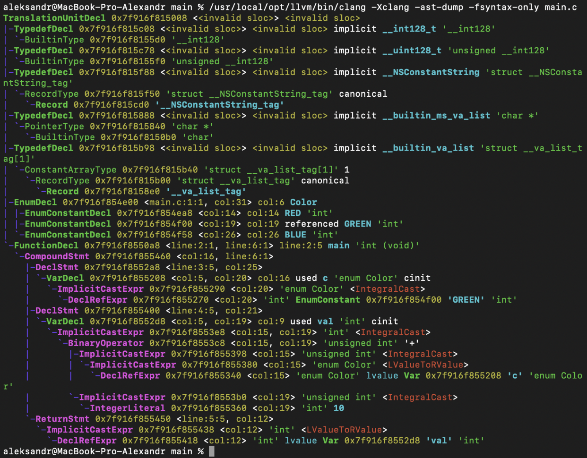

---

## 3) Получение LLVM IR и сравнение `-O0` vs `-O2`

### 3.1 Генерация LLVM IR (без указания уровня оптимизации)

```bash
/usr/local/opt/llvm/bin/clang -S -emit-llvm main.c -o main.ll
```

### 3.2 IR для `-O0` и `-O2`

```bash
/usr/local/opt/llvm/bin/clang -O0 -S -emit-llvm main.c -o main-O0.ll
/usr/local/opt/llvm/bin/clang -O2 -S -emit-llvm main.c -o main-O2.ll
```

Сравнение:

```bash
diff main-O0.ll main-O2.ll
```

### Ответ: заменяется ли `GREEN` на `1` сразу?

**Да. Уже на уровне `-O0` константа `GREEN` заменена на `1`.**

Качественное сравнение (по `Л7.docx`):

- **`-O0`**:
  - присутствуют `alloca` для `c`, `val`;
  - последовательность вида `alloca → store → load → add → store → load → ret`.
- **`-O2`**:
  - `alloca`/`load`/`store` для локальных переменных устранены;
  - выражение `GREEN(1) + 10` вычислено на этапе компиляции как `11`;
  - остаётся минимум инструкций (в примере из документа: ~2).

**Скриншоты IR:**

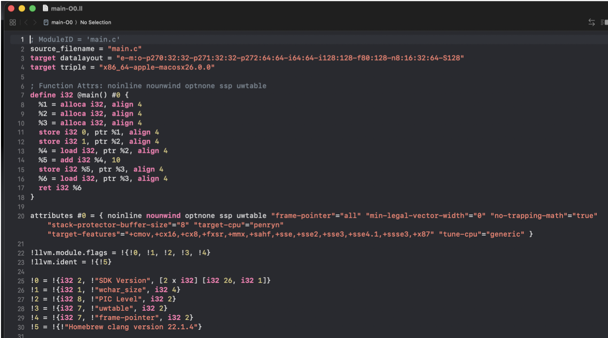

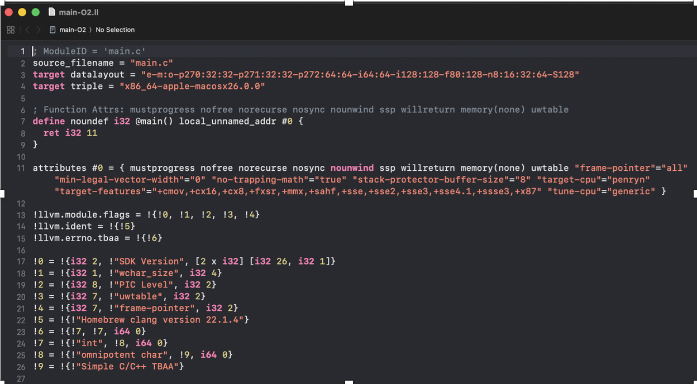

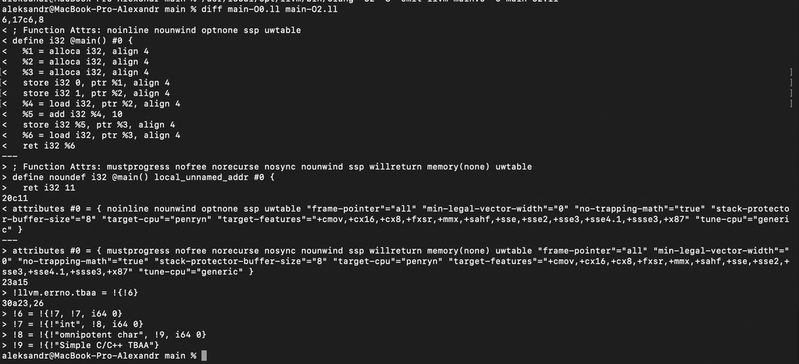

---

## 4) Построение CFG

### 4.1 Генерация оптимизированного IR

```bash
/usr/local/opt/llvm/bin/clang -O2 -S -emit-llvm main.c -o main.ll
```

### 4.2 Генерация `.dot` CFG через `opt`

```bash
/usr/local/opt/llvm/bin/opt -dot-cfg -disable-output main.ll
```

Установка Graphviz (если нужно):

```bash
brew install graphviz
```

Конвертация DOT → PNG:

```bash
dot -Tpng .main.dot -o cfg_main.png
open cfg_main.png
```


- Для `-O0`: один базовый блок (линейный код), ветвлений нет; много `alloca/load/store`.
- Для `-O2`: один базовый блок; максимум упрощений, в т.ч. вызов с константой `11` и `ret`.

**Скриншот CFG:**

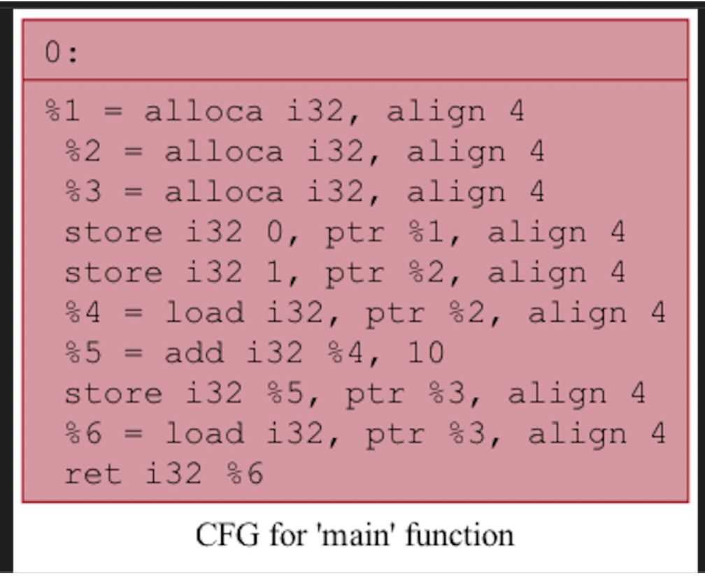

---

## 5) Вывод по влиянию перечислений на IR

Перечисления в C являются **«синтаксическим сахаром»**: они нужны для удобства чтения/поддержки кода, а компилятор сводит их к **целым константам** без накладных расходов во время выполнения.

---

## Дополнительное задание

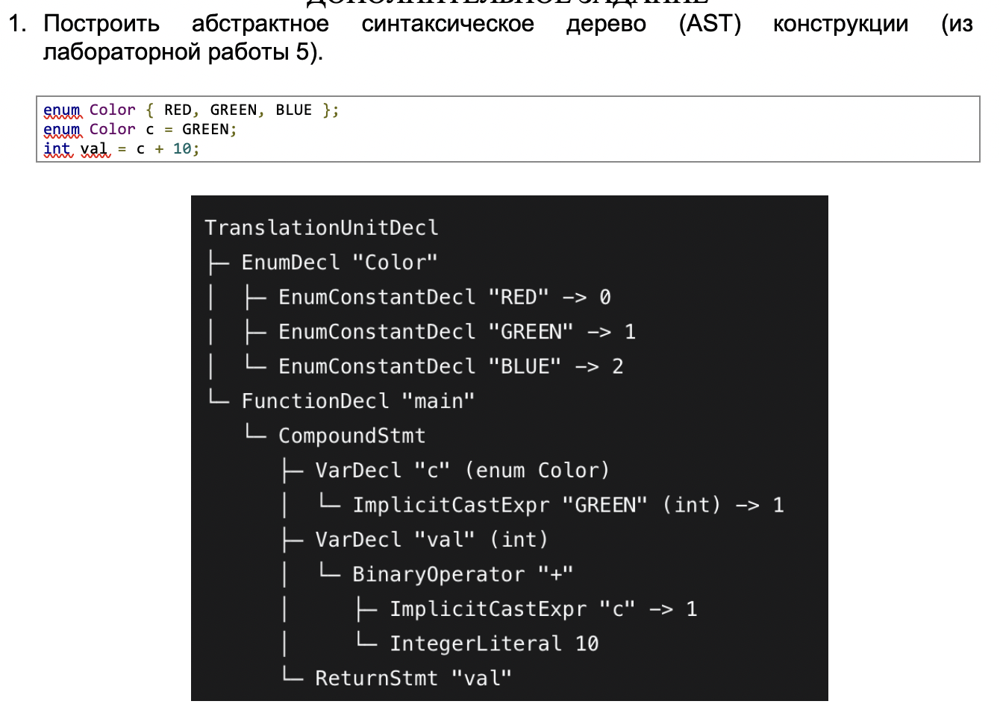
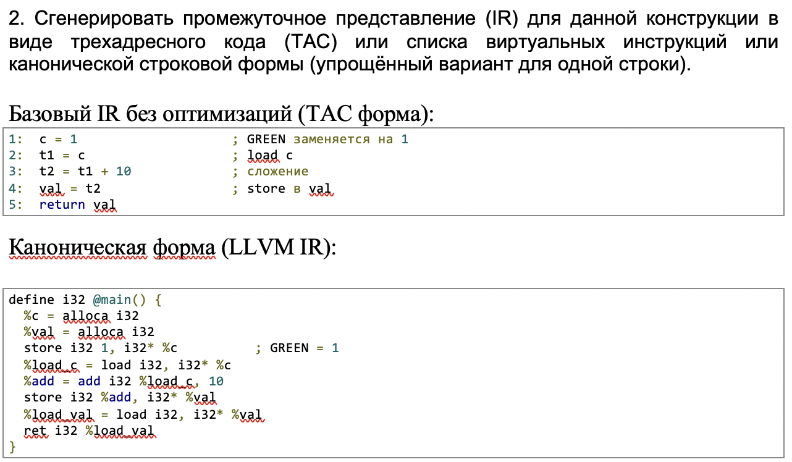
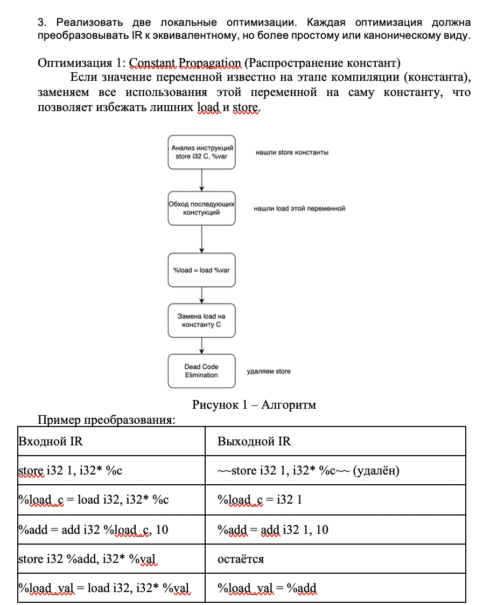
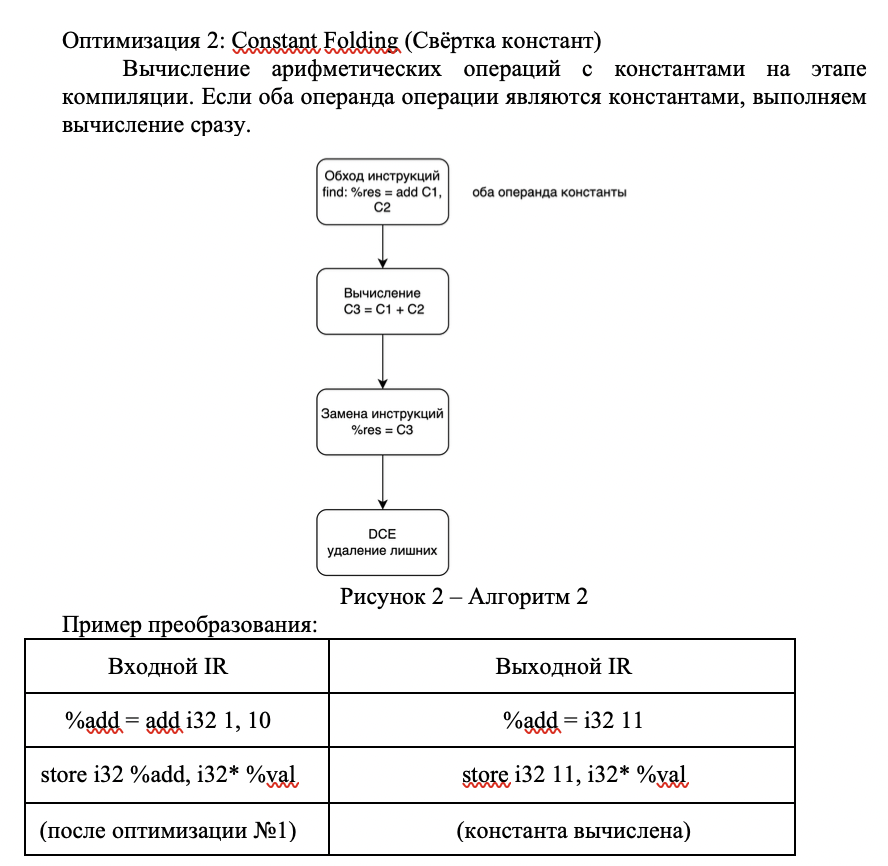
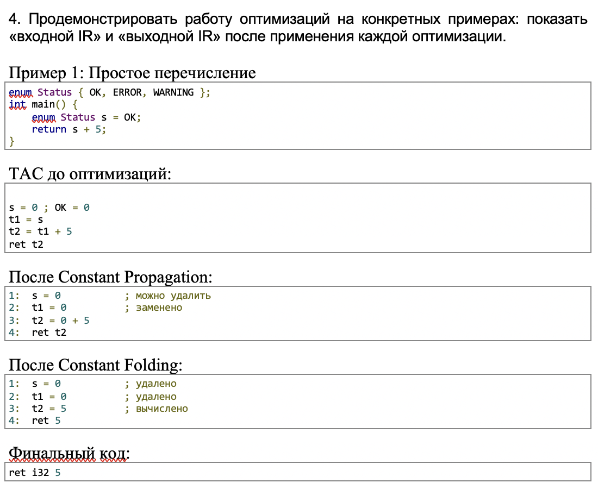
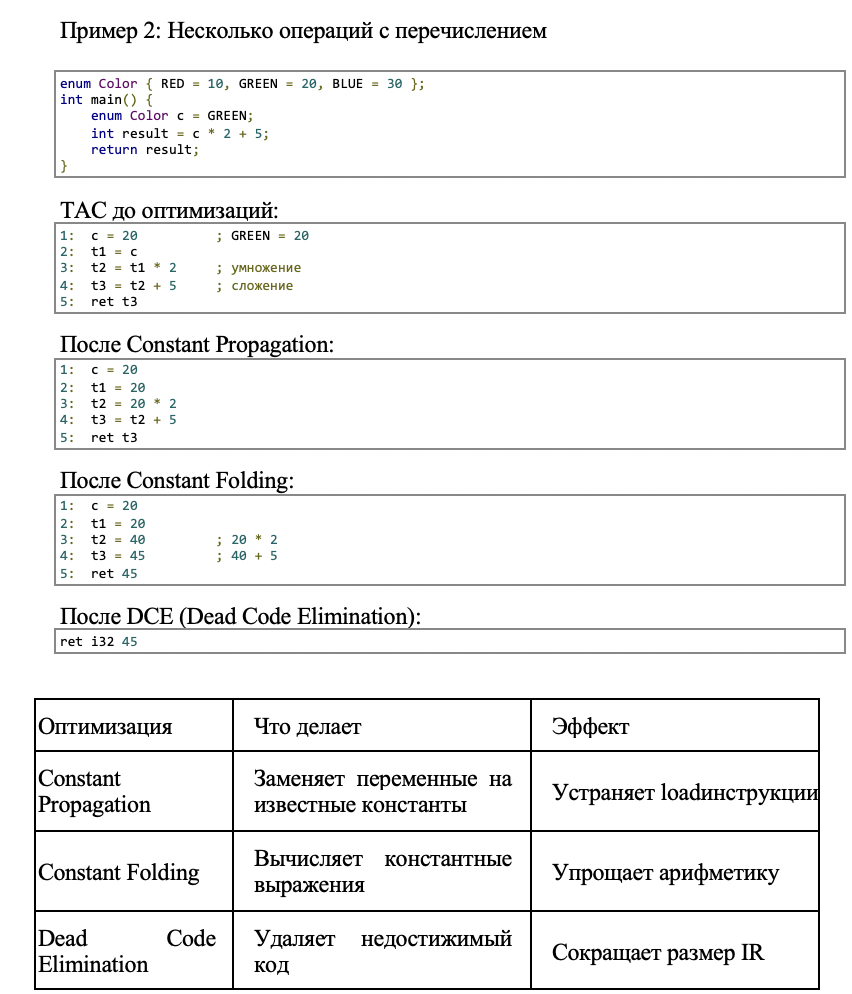