# Руководство пользователя

*В зависимости от платформы интерфейс может немного отличаться.*

 

## Запуск программы
- После запуска программы пользователь видит главное окно, где может выбрать действие из меню или быстрого доступа
- Изначально окно редактора недоступно из-за отсутствия в нем файла, необходимо создать его

 

  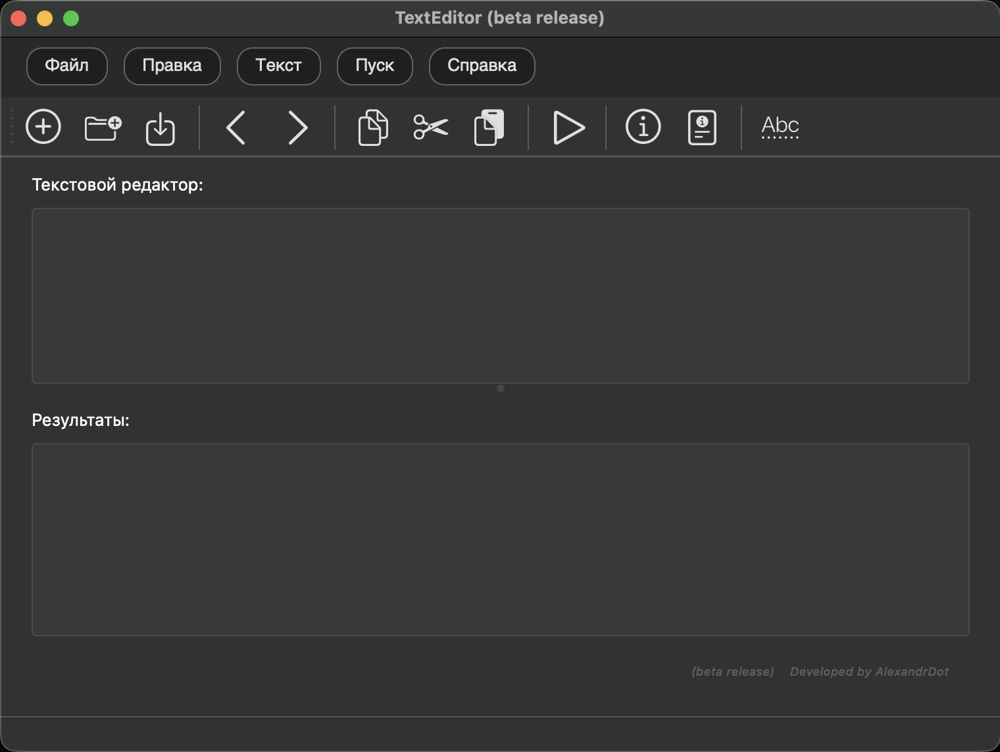

 

 

## Работа с пунктом "Файл"
1. При нажатии "создать" в редакторе появится новый текстовый документ, в котором можно вводить текст

  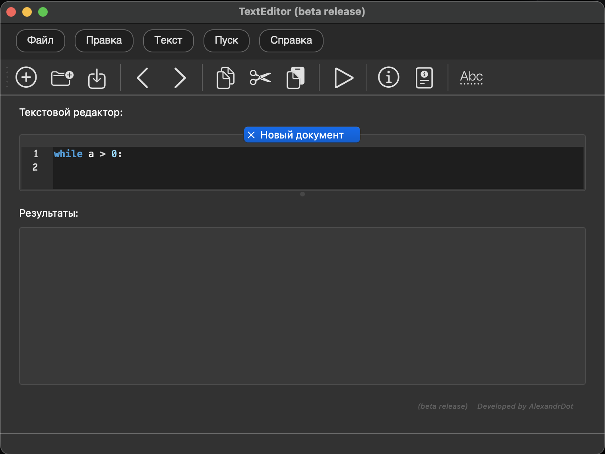

 

 
2. При нажатии "открыть" появляется проводник, с помощью которого можно найти необходимый документ и после выбора он отобразится в редакторе
 
 

  <table>
    <tr>
      <td>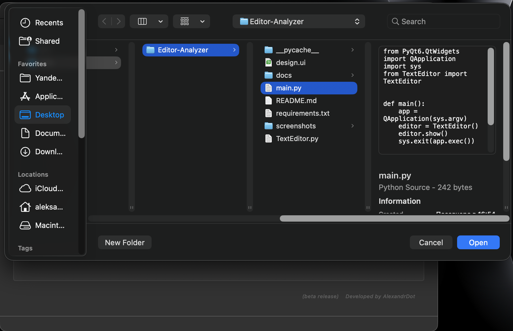</td>
      <td>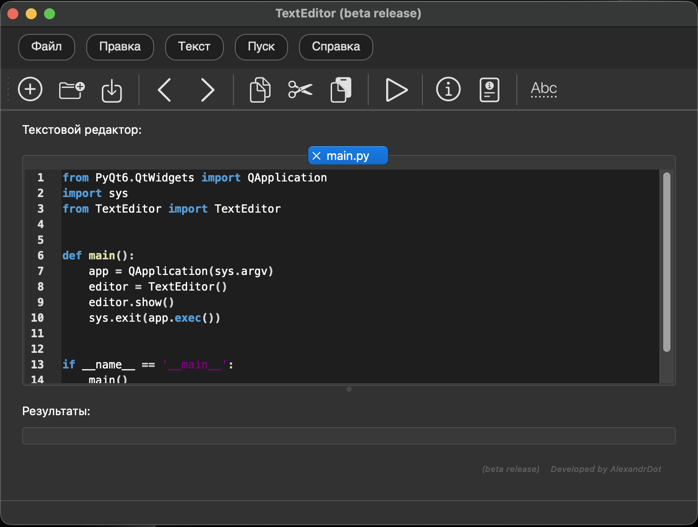</td>
    </tr>
    <tr>
      <td align="center"><em>Путь</em></td>
      <td align="center"><em>Появившийся файл</em></td>
    </tr>
  </table>

 

3. При нажатии "сохранить" для нового документа появится диалоговое окно с отображением куда и в каком варианте сохранить файл, для уже существующего произойдет сохранение изменений

4. При нажатии "сохранить как" появится аналогичное окно, как и в пункте 3)

  <table>
    <tr>
      <td>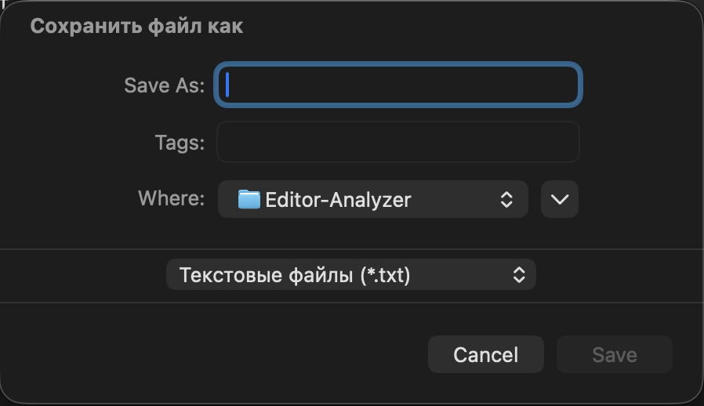</td>
      <td></td>
    </tr>
    <tr>
      <td align="center"><em>Куда сохранить</em></td>
      <td align="center"><em>Сохранение</em></td>
    </tr>
  </table>

 
5. При нажатии "выход" отобразится уведомление, если есть несохраненные файлы - их можно либо сохранить, либо удалить, а после произойдет выход из программы
 

  

 

 
 

## Работа с пунктом "Правка"

 

1. При нажатии **"отменить"** в активном файле редакторе произойдет откат к последнему изменению

  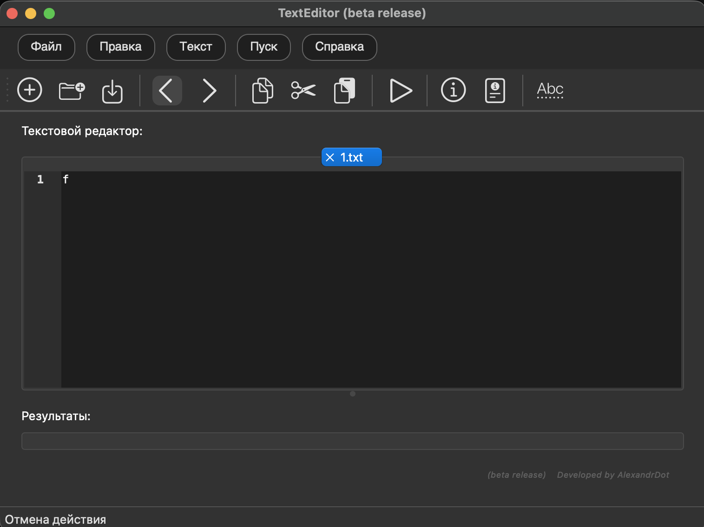

 
 

2. При нажатии **"повторить"** в активном файле редакторе произойдет возврат к последнему изменению

  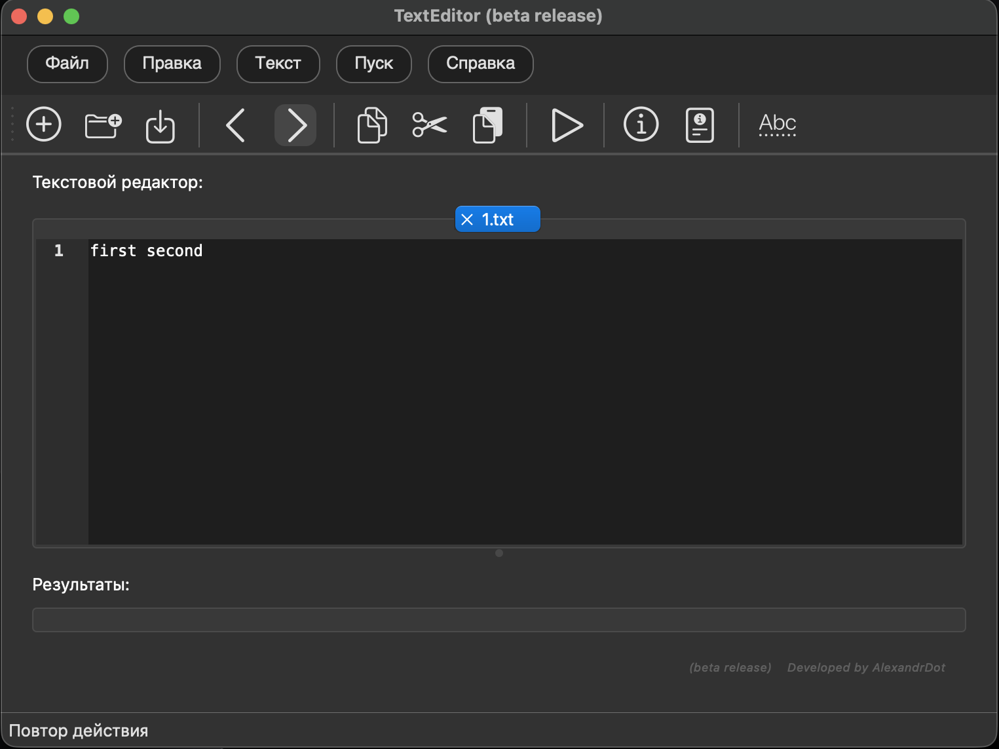

 
 

3. При нажатии **"вырезать"** в активном файле редакторе произойдет вырезание выделенного текста

  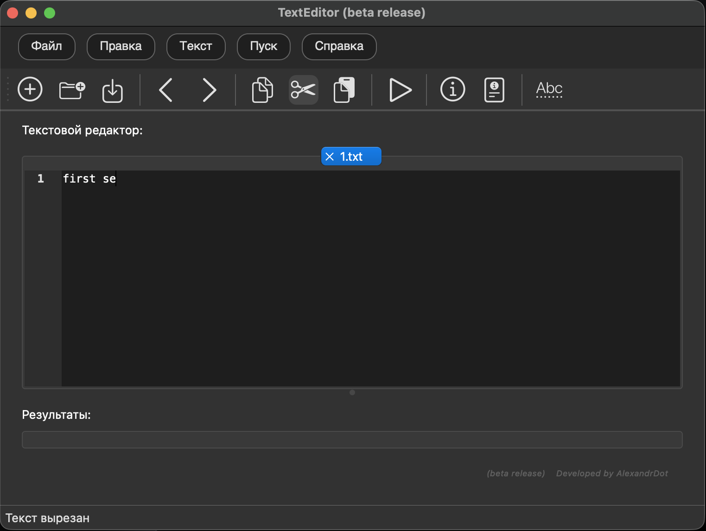

 
 

4. При нажатии **"копировать"** в активном файле редакторе произойдет копирование выделенного текста

  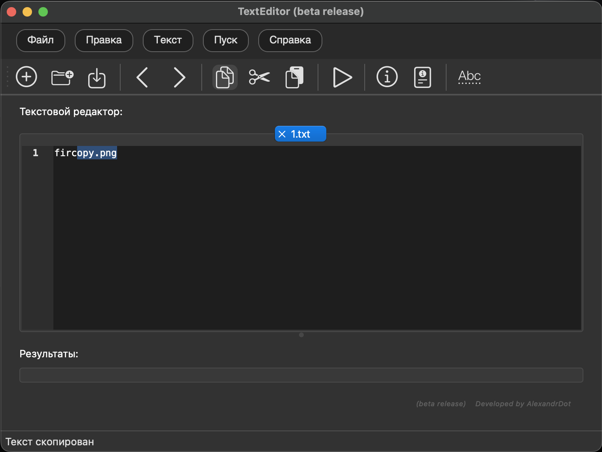

 
 

5. При нажатии **"вставить"** в активном файле редакторе произойдет вставка текста из буфера обмена

  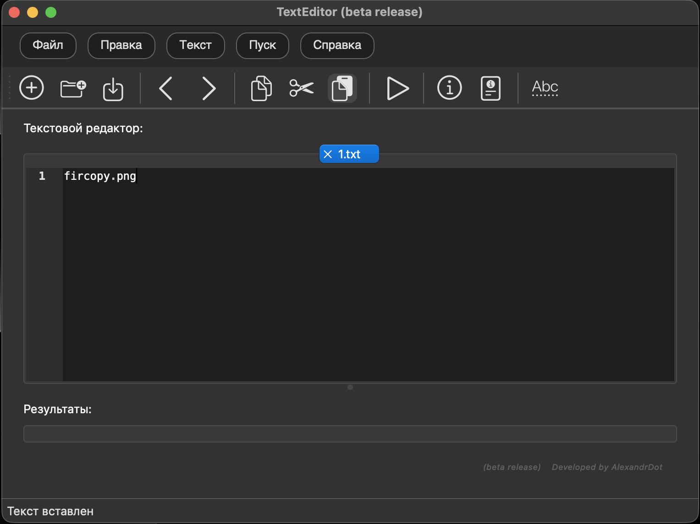

 
 

6. При нажатии **"удалить"** в активном файле редакторе произойдет удаление выделенного текста

  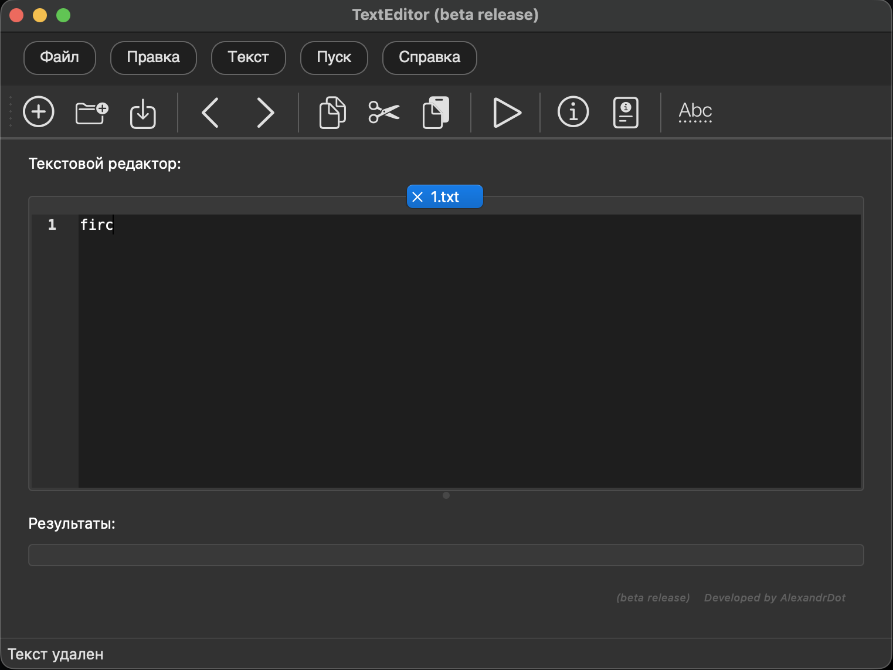

 
 

7. При нажатии **"выделить всё"** в активном файле редакторе произойдет выделение всего текста

  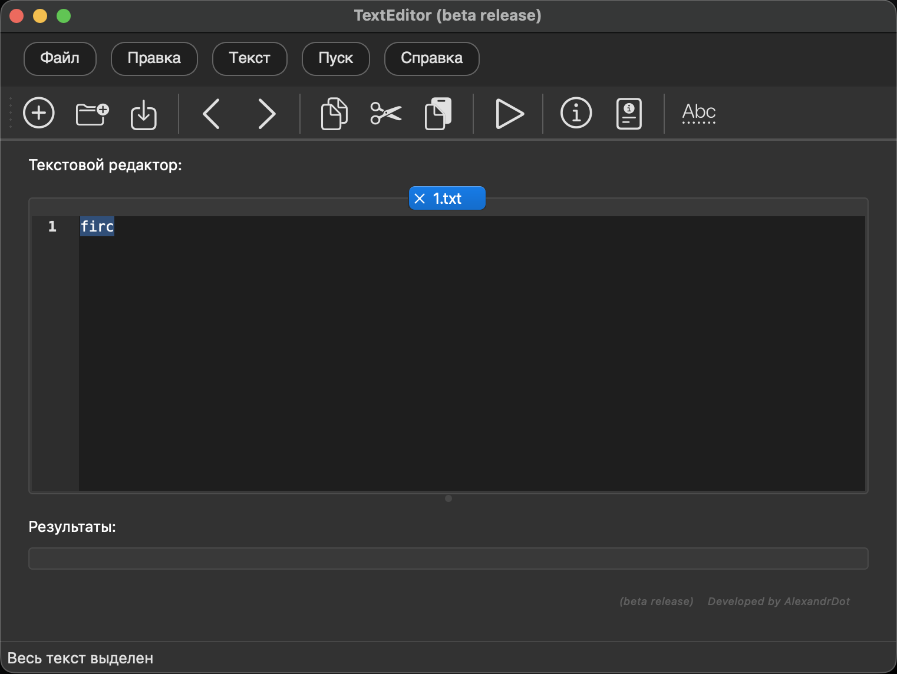

## Работа с пунктом "Текст"

### ***В разработке***

 
 

## Работа с пунктом "Пуск"

### ***В разработке***

 
 

## Работа с пунктом "Справка"

 

Меню "Справка" содержит информационные разделы, помогающие пользователю ознакомиться с программой и получить необходимую документацию.

  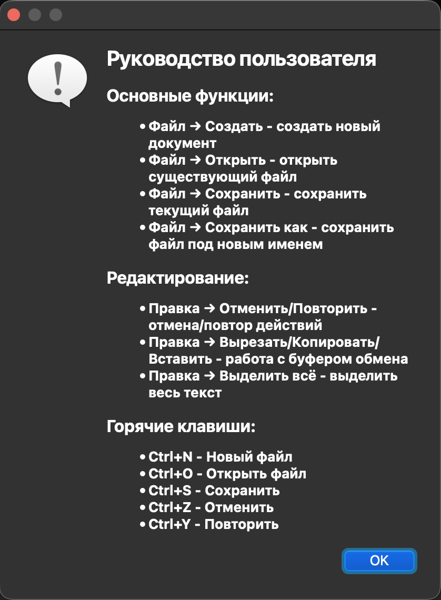

 
 

### 1. О программе

При выборе пункта **"о программе"** открывается диалоговое окно, содержащее информацию о версии приложения, годе выпуска, авторе и используемых технологиях. Это окно позволяет убедиться в актуальности версии и получить общие сведения о программе.

  

 
 

### 2. Руководство пользователя

При выборе пункта **"руководство"** открывается окно с кратким руководством по использованию программы. Здесь представлены основные функции и горячие клавиши. В нижней части окна расположена ссылка на полную документацию, где можно найти более подробную информацию.

  

 
 

### Дополнительная информация

- Все диалоговые окна закрываются по нажатию кнопки **OK**
- Текст в окнах можно выделять и копировать для использования в других приложениях
- Полная документация доступна по ссылке в окне руководства